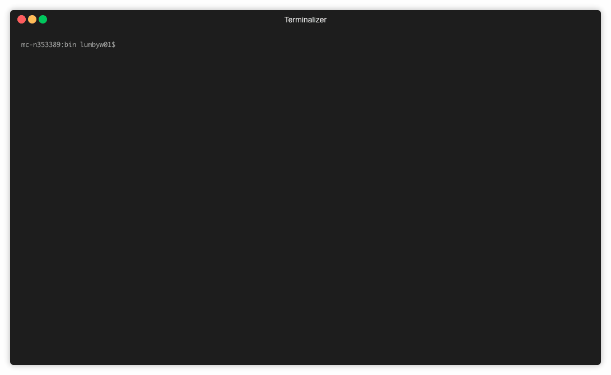

# GuildFinder
#### A WoWProgress scraper that finds retail guilds meeting specified criteria.

Uses the official [WoWProgress API](https://www.wowprogress.com/post/37_Data_Export), as well as some minimal scraping of guild pages to find
guilds matching the criteria the user inputs (realm, progress, class you play).

The full WoWProgress website can be found [here](https://www.wowprogress.com), with more in depth guild
information.

### Usage



Simply navigate to the `/bin/` directory and run:
 ```
 ./run.sh
 ```
 to launch the application. If you
have Golang installed and everything is installed correctly, you should be presented
with a list of classes. From here, follow the prompts to query WoWProgress for relevant guilds.

### WoWProgress API

This application makes use of the [WoWProgress API](https://www.wowprogress.com/post/37_Data_Export)
by querying its data export for realm data. This realm data can be accessed in the form of
gzipped JSON.